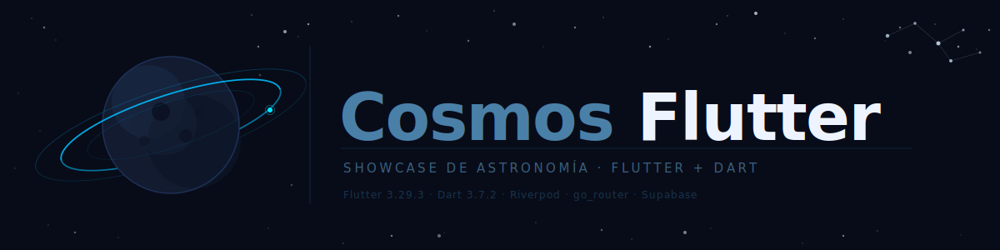

<p align="center">
  
</p>

# CosmosFlutter 🔭

> Showcase app de **astronomía básica** en Flutter, construida para demostrar las capacidades del framework usando el cosmos como hilo narrativo.

Cada módulo de la app resuelve un caso de uso astronómico real: rastrear la ISS en tiempo real, explorar el catálogo del sistema solar, recibir alertas de tormentas solares o navegar el cielo estrellado con el giroscopio del dispositivo.

**Plataformas:** Android (prioridad) → Web → iOS

---

## Módulos del showcase

| Módulo | Capacidad Flutter demostrada | Caso de uso astronómico |
|---|---|---|
| `navigation/` | go_router — ShellRoute, GoRoute, Drawer | Navegar entre Planetas, ISS, APOD, Eventos |
| `lists/` | ListView.builder / SliverList — virtualización | Catálogo de planetas, lunas y asteroides |
| `forms/` | reactive_forms — validación reactiva | Búsqueda de asteroides por fecha |
| `animations/` | AnimationController + CustomPainter — UI thread | Órbitas planetarias y rotación 3D |
| `camera/` | camera plugin — acceso a hardware | AR overlay de constelaciones ⚡ |
| `maps/` | google_maps_flutter + geolocator | Mapa con posición en tiempo real de la ISS |
| `storage/` | shared_preferences + drift (SQLite) | Caché APOD y diario de favoritos |
| `notifications/` | flutter_local_notifications + FCM | Alertas de tormentas solares y paso ISS |
| `sensors/` | sensors_plus — giroscopio / acelerómetro | Mapa estelar controlado por movimiento |
| `auth/` | supabase_flutter Auth + local_auth biometría | Diario personal de observaciones |
| `realtime/` | supabase_flutter Realtime subscriptions | Posición ISS broadcast multi-cliente |
| `platform/` | Platform.isAndroid / kIsWeb — diferencias nativas | Comparativa Android / Web / iOS |

> ⚡ Stretch goal — opcional en la entrega académica.

---

## Stack

| Capa | Tecnología | Versión |
|---|---|---|
| SDK | Flutter | 3.29.x (stable) |
| Lenguaje | Dart | 3.7.x (sound null safety) |
| Navegación | go_router | pinear al instalar |
| Animaciones | AnimationController + flutter_animate | nativo + pinear |
| Estado global | flutter_riverpod | pinear al instalar |
| Fetching / caché | flutter_riverpod AsyncNotifier | nativo |
| Formularios | reactive_forms | pinear al instalar |
| Backend | supabase_flutter (free tier) | pinear al instalar |
| Package manager | pub (incluido en Flutter CLI) | — |

---

## APIs astronómicas

| API | URL base | Auth |
|---|---|---|
| NASA APOD | `https://api.nasa.gov/planetary/apod` | API key gratuita |
| NASA NeoWs | `https://api.nasa.gov/neo/rest/v1` | API key gratuita |
| NASA DONKI | `https://api.nasa.gov/DONKI` | API key gratuita |
| Solar System OpenData | `https://api.le-systeme-solaire.net/rest` | Sin auth |
| Open-Notify ISS | `http://api.open-notify.org/iss-now.json` | Sin auth |
| Open-Notify Astronauts | `http://api.open-notify.org/astros.json` | Sin auth |

---

## Requisitos previos

- [Flutter SDK](https://docs.flutter.dev/get-started/install) ≥ 3.29 (stable)
- [Android Studio](https://developer.android.com/studio) con un AVD configurado (para Android)
- [Chrome](https://www.google.com/chrome/) para desarrollo Web (`flutter run -d chrome`)
- Cuenta gratuita en [api.nasa.gov](https://api.nasa.gov/) para obtener la API key
- Proyecto gratuito en [supabase.com](https://supabase.com/) para el backend

---

## Instalación

```bash
# 1. Clonar el repositorio
git clone <url-del-repo>
cd proyecto-flutter

# 2. Instalar dependencias
flutter pub get

# 3. Configurar variables de entorno
cp .env.example .env
# Editar .env con las claves reales (ver sección Variables de entorno)

# 4. Verificar el entorno Flutter
flutter doctor
```

---

## Variables de entorno

Copiar `.env.example` a `.env` y completar los valores.  
El proyecto carga el archivo `.env` en tiempo de ejecución con `flutter_dotenv`.

```bash
# NASA Open APIs — registrar en https://api.nasa.gov/
NASA_API_KEY=tu_clave_nasa_aqui

# Supabase — obtener en https://supabase.com/dashboard/project/_/settings/api
SUPABASE_URL=https://xxxxxxxxxxxx.supabase.co
SUPABASE_ANON_KEY=eyJhbGciOiJIUzI1NiIsInR5cCI6IkpXVCJ9...
```

> **Nunca** commitear el archivo `.env`. El `.gitignore` ya lo excluye.  
> La `service_role` key de Supabase **no debe aparecer** en el cliente móvil.

---

## Comandos de desarrollo

```bash
# Ejecutar en Android (emulador o dispositivo)
flutter run -d android

# Ejecutar en Web
flutter run -d chrome

# Ejecutar en iOS (requiere macOS y Xcode)
flutter run -d ios

# Hot reload activo durante la ejecución: pulsar 'r' en la terminal
```

---

## Comandos de calidad — ejecutar antes de cada commit

```bash
# Análisis estático (tipos + lint)
dart analyze

# Formateo automático
dart format --set-exit-if-changed lib/ test/

# Tests con cobertura (umbral mínimo: 80% por módulo)
flutter test --coverage

# Auditoría de dependencias (CVEs)
dart pub audit
```

> Si alguno de estos comandos falla, **el commit queda bloqueado** hasta corregirlo.

---

## Estructura del proyecto

```
lib/
  modules/
    navigation/       → go_router: ShellRoute, GoRoute, Drawer
    lists/            → ListView.builder / SliverList
    forms/            → reactive_forms
    animations/       → AnimationController, CustomPainter
    camera/           → camera plugin (AR) ⚡
    maps/             → google_maps_flutter + geolocator
    storage/          → shared_preferences + drift
    notifications/    → flutter_local_notifications
    sensors/          → sensors_plus: giroscopio, acelerómetro
    auth/             → supabase_flutter auth + local_auth
    realtime/         → supabase_flutter Realtime
    platform/         → diferencias de plataforma
    artemis/          → misiones lunares + galería NASA
  shared/
    widgets/          → widgets reutilizables
    providers/        → Riverpod providers transversales
    repositories/
      nasa_repository.dart        → cliente HTTP NASA APIs
      solar_system_repository.dart → cliente Solar System OpenData
      iss_repository.dart         → cliente Open-Notify
      supabase_client.dart        → singleton Supabase
    theme/            → ThemeData, colores, tipografía, dark/light
test/
  modules/            → tests espejo de lib/modules/
  shared/             → tests de repositories y providers
docs/
  PLAN_TRABAJO.md             → checklist de desarrollo
  requirements/
    functional.md             → requisitos funcionales
    non-functional.md         → requisitos no funcionales
    user-stories.md           → historias de usuario
    constraints.md            → restricciones del proyecto
.github/
  copilot-instructions.md     → instrucciones para GitHub Copilot
  prompts/                    → prompts reutilizables de Copilot
  instructions/               → reglas contextuales por área
```

---

## Convenciones de código

| Elemento | Idioma |
|---|---|
| Variables, funciones, clases, archivos | **inglés** |
| Comentarios en código y dartdoc | **español** |
| Mensajes de error en UI | **español** |
| Commits, branches, PR titles | **inglés** |

Documentación TSDoc obligatoria en cada función, hook y componente:

```ts
/**
 * @what  qué hace exactamente este elemento
 * @why   por qué existe en el contexto del módulo
 * @impact qué se rompe o cambia si se modifica
 */
```

---

## Commits

Formato [Conventional Commits](https://www.conventionalcommits.org/) con cuerpo pedagógico:

```
feat(maps): add ISS real-time position tracking

For: the maps module needs to demonstrate real-time data updates
     bound to a native map component
Impact: enables the realtime module to reuse the useIssPosition hook
```

Tipos: `feat` · `fix` · `chore` · `docs` · `refactor` · `test` · `style` · `ci`

---

## Testing

- Framework: **flutter_test** (nativo) + **mocktail**
- Cobertura mínima obligatoria: **80 % de líneas y ramas por módulo**
- Los tests viven en `test/modules/<nombre>/`

```bash
flutter test                    # ejecutar todos los tests
flutter test --coverage         # con reporte de cobertura
flutter test --watch            # modo watch durante desarrollo (flutter_test_runner)
```

---

## Seguridad

- Dependencias auditadas con `dart pub audit` antes de cada commit.
- Versiones exactas en `pubspec.yaml` (sin `^`, `>=`, `any`).
- RLS habilitado en todas las tablas de Supabase desde la primera migración.
- Tokens de sesión almacenados en `flutter_secure_storage` (keychain / keystore nativo).

---

## Licencia

Proyecto académico — sin licencia comercial.  
El uso de las APIs de NASA y Solar System OpenData está sujeto a sus respectivos [términos de uso](https://api.nasa.gov/).
